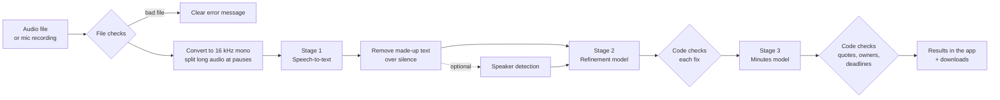

# LazyMeets

You give it a meeting recording, and it gives you back:

- the **raw transcript**, straight from speech-to-text
- a **cleaned-up transcript** where misheard terms, acronyms and names are fixed
- **minutes**: a short summary and the main points, topic by topic
- **decisions**: only the things people actually agreed on
- **action items**: what has to be done, who it's for, and by when. The owner and deadline are only filled in if someone actually said them. Otherwise they say "Unspecified".

Everything shows up in a web app, and you can download it as Markdown, JSON, CSV, subtitles (SRT) or a single HTML report.

Made for the Inter IIT Tech Meet 15.0 Bootcamp (ML PS).

---

## How the pipeline works



Step by step:

1. **Upload and checks.** Before anything is sent anywhere, the file gets checked: right type, not empty, not corrupted, actually has sound in it. If something's wrong you get a plain message saying what.
2. **Audio prep.** The audio is converted to 16 kHz mono. Anything longer than about 10 minutes is cut into parts at quiet moments, so no word gets chopped in half.
3. **Stage 1, speech-to-text.** Whisper turns the audio into text with timestamps. It's given the participant names and glossary as a spelling hint. Bits Whisper sometimes invents over silence (like "Thanks for watching!") are detected and removed, and parts it wasn't sure about are marked.
4. **Speaker detection (optional).** Figures out who spoke when, so lines get labelled "Speaker 1", "Speaker 2" and so on. You can rename them to real names in the app.
5. **Stage 2, refinement.** The first language model reads the transcript and suggests small fixes for misheard words ("cooper netties" → "Kubernetes"). It can't rewrite sentences. Code checks every fix and blocks anything that changes a number, a "not", a "will/might", or a name, and anything that doesn't sound like the original word. Blocked fixes are still shown, with the reason.
6. **Stage 3, minutes.** The second language model writes the summary, minutes, decisions, proposals nobody agreed on, action items and open questions. Every item has to come with an exact quote from the transcript.
7. **Checking the minutes.** Code looks for each quote in the transcript and drops anything it can't find. An owner is only kept if the transcript ties that person to the task, and a deadline only if it was actually said. "Maybe someone could…" goes under suggested follow-ups, not under tasks.
8. **Results.** Everything comes from one record, so the app, the Markdown, the JSON, the CSV and the HTML report always match.

If a stage fails (rate limit, bad file, provider down), the steps that finished are kept and you can retry from the stage that failed.

---

## Models

### The ones we use by default

| Stage | Model | What it does |
|---|---|---|
| 1. Speech-to-text | **Whisper large-v3** (OpenAI's model, hosted on Groq) | Turns audio into text with timestamps and confidence scores. Good with accents and technical words. |
| 2. Refinement (language model #1) | **GPT-OSS 20B** (`openai/gpt-oss-20b` on Groq) | A smaller, fast model. Only suggests small word fixes. Code decides whether each fix is safe. |
| 3. Minutes (language model #2) | **GPT-OSS 120B** (`openai/gpt-oss-120b` on Groq) | The bigger model. Does the harder job of telling decisions from tasks and finding owners and deadlines. Also answers questions in the "Ask the meeting" tab. |

The two language models are separate models with separate prompts (in `prompts/`). Both are asked for strict JSON output, so their answers always parse.

### On standby

You can switch to these from the sidebar if a default model hits its limit or gets retired:

| Model | Where | When you'd use it |
|---|---|---|
| **Whisper large-v3-turbo** | Groq | Faster and cheaper speech-to-text, but makes more mistakes. |
| **GPT-OSS 120B / 20B** (swapped) | Groq | Either language model stage can use either size. Using 120B for refinement catches more fixes but uses more of the rate limit. |
| **Qwen 3.8 27B** (`qwen/qwen3.8-27b`) | Groq | Backup language model for either stage. |
| **Moonshine base + Silero VAD** | Runs on your own CPU | Fully offline speech-to-text, for when the audio shouldn't leave the computer. Less accurate than Whisper. |
| **pyannote segmentation 3.0 + NVIDIA TitaNet-small** | Runs on your own CPU | Speaker detection (who spoke when). Off by default because it's slower. |

The offline models run through `sherpa-onnx` and don't need a GPU.

---

## APIs we call

Everything online goes through **Groq's OpenAI-compatible API** (`https://api.groq.com/openai/v1`). One free Groq key covers all three stages.

| Call | Endpoint | Used for |
|---|---|---|
| List models | `GET /models` | Checks the key and the model names before starting, so a typo fails in a second instead of after a long transcription. |
| Transcription | `POST /audio/transcriptions` | Stage 1. Sends each audio part to Whisper and gets back text with segment and word timestamps. |
| Chat completions | `POST /chat/completions` | Stage 2 (refinement), stage 3 (minutes), and the "Ask the meeting" tab. Uses JSON-schema structured output. |

Other things worth knowing:

- **Rate limits.** The free tier allows a limited number of tokens per minute per model. The app reads the `x-ratelimit-*` headers Groq sends back, plans each request to fit, and waits when it has to. That's the "Pacing requests…" message you sometimes see. Long meetings get processed in parts and merged at the end.
- **Offline model downloads.** If you turn on speaker detection or offline transcription, the small model files get downloaded once from the `sherpa-onnx` GitHub releases and cached on your computer. After that, those parts don't need the internet.
- **Other providers.** Any OpenAI-compatible API works. Change the base URL and key in the sidebar's settings.

Nothing else is called. No analytics, no tracking.

---

## How to run it

Choose the required process , i.e , upload a file or record the audio directly. To manage the token usage we have limited the uploaded file size to 200MB.

Next press "Process Meeting" and let wait.

Then you will get the following outputs , also available for download : 
    1. Meeting records
    2. Transcripts
    3. Refinement Changes

Under the meeting we will get : KEY DECISIONS , ACTION ITEMS , SUGGESTED follow-ups , Proposals not agreed , Open questions , Minutes

---

## What you can download

| File | What's in it |
|---|---|
| `raw_transcript.txt` / `.srt` | What speech-to-text heard, before any language model touched it |
| `refined_transcript.txt` / `.srt` | After the word fixes (same timestamps) |
| `meeting_record.md` | The readable record: summary, minutes, decisions, action items |
| `meeting_record.json` | Same record for code. Missing owner or deadline is `"Unspecified"` |
| `action_items.csv` | Tasks with target, owner and deadline, ready for a spreadsheet |
| `meeting_report.html` | One-file report with the audio inside. Click any timestamp to hear that moment |
| `refinement_changes.csv` | Every fix that was suggested: applied, blocked, and why |

---

## Project layout

```
app.py                  the web app (Streamlit)
cli.py                  same pipeline from the command line
prompts/                instructions for each language model
meetscribe/
  audio.py              file checks, conversion, splitting long audio
  stt.py                stage 1: Whisper (or offline Moonshine) + removing made-up text
  diarize.py            optional speaker detection
  refine.py             stage 2: refinement + applying fixes
  guards.py             the checks that block unsafe fixes
  minutes.py            stage 3: minutes + checking quotes, owners, deadlines
  qa.py                 "Ask the meeting"
  llm.py                API client: retries, rate limits, JSON output
  pipeline.py           runs the stages in order and saves each run
  exports.py, render.py download files and the HTML report
tests/                  tests that run against a fake Groq API (no key needed)
samples/                a 2-minute demo meeting and its script
```

More detail on each stage and why each check exists is in [TECHNICAL.md](TECHNICAL.md).
