# LazyMeets: technical description

## Models and their roles

| Stage | Model | Where it runs | Input → output |
|---|---|---|---|
| 1. Speech-to-text | **Whisper large-v3** (`whisper-large-v3`) | Groq API | 16 kHz mono FLAC audio → timestamped segments with confidence scores (`avg_logprob`, `no_speech_prob`, `compression_ratio`) and word timings |
| 2. Transcript refinement (LM #1) | **GPT-OSS 20B** (`openai/gpt-oss-20b`) | Groq API | numbered raw segments + glossary/participants → a list of span corrections (JSON) |
| 3. Meeting documentation (LM #2) | **GPT-OSS 120B** (`openai/gpt-oss-120b`) | Groq API | refined segments with ids, times and speakers → summary, minutes, decisions, proposals, action items, open questions (JSON) |
| Optional: speaker detection | pyannote segmentation-3.0 + NVIDIA TitaNet-small (ONNX, sherpa-onnx) | local CPU | audio → who-spoke-when turns, used to label segments |
| Optional: offline speech-to-text | Moonshine base (ONNX) + Silero VAD | local CPU | replaces stage 1 when no API should see the audio |

The two language models are different models in separate stages, with separate prompts (`prompts/refine.md`, `prompts/minutes.md`). Both are called with **strict JSON-schema structured output**, so the responses always parse. If a model doesn't support strict mode, the client falls back to best-effort schema mode, then to plain JSON mode.

## How data moves through the pipeline

```mermaid
flowchart LR
    A[Audio file] --> V{Checks: type, size,<br/>decodable, has audio,<br/>not silent}
    V -->|bad| E[Clear error in UI]
    V --> C[ffmpeg: 16 kHz mono FLAC<br/>split at pauses if long]
    C --> W[Stage 1: Whisper large-v3<br/>prompt = names + glossary]
    W --> H[Drop hallucinations over silence<br/>flag low-confidence segments]
    H -.optional.-> D[Speaker detection<br/>split segments at speaker changes]
    H --> R0[(Raw transcript)]
    D --> R0
    R0 --> L1[Stage 2: GPT-OSS 20B<br/>proposes span corrections]
    L1 --> G{Meaning checks in code}
    G -->|safe| R1[(Refined transcript<br/>same ids + timestamps)]
    G -->|blocked| B[Shown with reason]
    R1 --> L2[Stage 3: GPT-OSS 120B<br/>record with quotes + segment ids]
    L2 --> X{Verification in code}
    X --> M[(Meeting record)]
    M --> O[UI + exports: md, json, csv, html, txt, srt]
```

1. **Upload and checks.** The file is checked before anything is sent anywhere: extension, size, non-empty. Then ffmpeg decodes it. That catches corrupted files, video with no audio track, recordings under 1 second, and silent recordings. Each failure becomes a specific message in the interface.
2. **Stage 1, speech-to-text.** The audio is converted to 16 kHz mono FLAC. Anything over ~10 minutes, or anything that would be over the API's 25 MB file limit, is split at the quietest point near each boundary, and the timestamps are shifted back. Whisper gets a short `prompt` built from the participant names and glossary, which helps it spell names and terms right in the raw transcript. Segments come back with confidence values. A segment is dropped as a hallucination when Whisper itself says there was no speech, when it's a known filler phrase ("Thanks for watching") over silence, or when it just repeats the prompt. Dropped segments are listed in the UI. Low-confidence segments are marked.
3. **Optional speaker detection.** Speaker turns are matched to Whisper's word timings, and a segment is split where the speaker changes. Users can rename "Speaker 1" etc. in the UI.
4. **Stage 2, refinement (LM #1).** The model sees numbered segments `[12] text` plus the meeting context. It returns `{segment_id, original, category, reason, corrected}` items. It never returns a rewritten transcript. Code then, for each item:
   - finds `original` in that segment (exact, then case-insensitive, then fuzzy, always on word boundaries)
   - **blocks** it if it changes any number (words and digits are normalized, so "Q three" → "Q3" is fine but "420" → "240" is not), a negation, a commitment or certainty word, or a participant's name (names only change to a spelling from the participant list or glossary), or if the new words don't sound or look like the old ones (character similarity + Metaphone, a lower bar for glossary terms), or if the edit is a long rewrite
   - applies the safe ones. A fixed multi-word mishearing is also applied wherever else it appears.

   Segment ids and timestamps never change, so raw and refined line up one-to-one for the side-by-side view.
5. **Stage 3, documentation (LM #2).** The refined transcript goes in as `[id | mm:ss | speaker] text`. The prompt separates **decisions** (clearly agreed) from **proposals not agreed** (rejected, deferred or undecided). It also separates **confirmed tasks** from **tentative** ones (only floated, nobody committed). A plain plan like "Sindhu will take the viva on 11th October" counts as both a decision and a confirmed task (owner Sindhu, deadline as said). A doubtful reply ("Are you sure?") doesn't cancel it; only a real objection or change does. Owner and deadline are filled only when stated, written as said, never turned into dates. Each task also gets a target type: a named person, everyone, the speaker themselves ("I'll…"), or unclear. Code turns that into the Target column: the name (only if it's said near the task), "Everyone", or the speaker's name from speaker detection. Every item carries an exact `evidence_quote` and its `segment_ids`. Then code verifies:
   - each quote is fuzzy-matched against the transcript. Items whose quote isn't found and whose content isn't in the transcript are dropped.
   - an **owner** is kept only if the name appears in the owner quote or near the task, or if the segment's speaker label is that person (self-commitment with speaker detection). Group owners like "we" or "the team" become Unspecified.
   - a **deadline** is kept only if its words (and numbers) appear in the deadline quote or next to the task
   - tentative tasks go to "Suggested follow-ups (not confirmed)" with no owner

   Everything the checks changed is listed in "Automatic checks" in the UI and the Markdown export.
6. **Outputs.** One `MeetingRecord` object feeds the UI, `meeting_record.md`, `meeting_record.json`, `action_items.csv` and the HTML report, so they always list the same decisions and tasks. Missing owners and deadlines are written as `Unspecified`. Empty lists are shown as "No decisions were reached" / "No action items were assigned".

## Reliability

- **Rate limits.** The client reads `x-ratelimit-*` headers to learn the tokens-per-minute limit, sizes each request to fit it, and waits for the window to reset when needed. On HTTP 429 it waits for `retry-after`. Daily-quota errors become a clear message. On a small budget, refinement runs in batches, and minutes run part by part (each part has the earlier parts' summary for context) followed by a merge step. If a model runs out of output tokens, it's retried with less reasoning.
- **Fail fast.** The API key and all model names are checked before transcription starts.
- **One job at a time.** Processing and Q&A run in a background thread, so clicks in the page can't interrupt or duplicate them. Every work button is disabled while a job runs, and the same audio isn't processed twice in a session.
- **Resume.** Each stage's output is saved in the run folder. If stage 3 fails, a retry runs only stage 3.
- **Tests.** A pytest suite runs against a local fake of the Groq API. It covers the checks, bad files, retries, resume and a full end-to-end run with exports.

## Optional features beyond the brief

Mic recording in the browser, a demo meeting, domain glossaries, speaker detection with renaming, an audio player with click-to-seek from any decision or task, follow-along transcript highlighting, raw vs refined diff, Q&A over the meeting with timestamped answers, an email draft, an interactive HTML report, SRT subtitles, a CLI, offline transcription, run history, and a WER/term-accuracy evaluation script.
